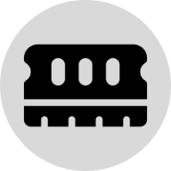

<!-- Improved compatibility of back to top link: See: https://github.com/othneildrew/Best-README-Template/pull/73 -->
<a name="readme-top"></a>
<!--
*** Thanks for checking out the Best-README-Template. If you have a suggestion
*** that would make this better, please fork the repo and create a pull request
*** or simply open an issue with the tag "enhancement".
*** Don't forget to give the project a star!
*** Thanks again! Now go create something AMAZING! :D
-->


<!-- PROJECT SHIELDS -->
<!--
*** I'm using markdown "reference style" links for readability.
*** Reference links are enclosed in brackets [ ] instead of parentheses ( ).
*** See the bottom of this document for the declaration of the reference variables
*** for contributors-url, forks-url, etc. This is an optional, concise syntax you may use.
*** https://www.markdownguide.org/basic-syntax/#reference-style-links
-->

<!-- PROJECT LOGO -->
<br />
<div align="center">
  <a href="https://github.com/codyalanstubbs/top-memory-game">
    
  </a>

<h3 align="center">Cody's Memory Card Game | The Odin Project</h3>

  <p align="center">
    Build a memory card game that keeps track of a user's best and current scores.
    <a href="https://codyalanstubbs.com/the-odin-project/20-memory-game/">View Demo</a>
    <br />
  </p>
</div>


<!-- TABLE OF CONTENTS -->
<details>
  <summary>Table of Contents</summary>
  <ol>
    <li>
      <a href="#about-the-project">About The Project</a>
      <ul>
        <li><a href="#built-with">Built With</a></li>
      </ul>
    </li>
    <li><a href="#roadmap">Roadmap</a></li>
    <li><a href="#installation">Installation</a></li>
    <li><a href="#contact">Contact</a></li>
  </ol>
</details>


<!-- ABOUT THE PROJECT -->
## About The Project

[![Product Name Screen Shot][product-screenshot]](https://codyalanstubbs.com/the-odin-project/20-memory-game/)

Test out your short-term memory capacity with this memory card game! The game requires users to memorize what emojis they have clicked. 
Users continue to click the emojis that they believe they have not clicked until they click an emoji they have already clicked. 
The game increases in difficulty as with each round (e.g.: a card is add to the next sequence).

The aim of this project was to use function components in React.

<p align="right">(<a href="#readme-top">back to top</a>)</p>


### Built With

[![React][React.js]][React-url]

<p align="right">(<a href="#readme-top">back to top</a>)</p>


<!-- ROADMAP -->
## Roadmap

- [x] Add contact info

<p align="right">(<a href="#readme-top">back to top</a>)</p>

### Installation

1. Clone the repo
   ```sh
   git clone https://github.com/codyalanstubbs/top-memory-game.git
   ```
2. Install NPM packages
   ```sh
   npm install
   ```
3. Specify the homepage in your `package.json`
   ```json
     "homepage": "http://mywebsite.com/relativepath",
   ```
4. Create the production build
   ```sh
   npm run build
   ```
5. Copy the contents of build directory into your relative path directory 

<p align="right">(<a href="#readme-top">back to top</a>)</p>


<!-- CONTACT -->
## Contact

Your Name - [@codyalanstubbs](https://twitter.com/@codyalanstubbs)

Project Link: [https://github.com/codyalanstubbs/top-memory-game](https://github.com/codyalanstubbs/top-memory-game)

<p align="right">(<a href="#readme-top">back to top</a>)</p>

<!-- MARKDOWN LINKS & IMAGES -->
<!-- https://www.markdownguide.org/basic-syntax/#reference-style-links -->
[contributors-shield]: https://img.shields.io/github/contributors/codyalanstubbs/top-memory-game.svg?style=for-the-badge
[contributors-url]: https://github.com/codyalanstubbs/top-memory-game/graphs/contributors
[forks-shield]: https://img.shields.io/github/forks/codyalanstubbs/top-memory-game.svg?style=for-the-badge
[forks-url]: https://github.com/codyalanstubbs/top-memory-game/network/members
[stars-shield]: https://img.shields.io/github/stars/codyalanstubbs/top-memory-game.svg?style=for-the-badge
[stars-url]: https://github.com/codyalanstubbs/top-memory-game/stargazers
[issues-shield]: https://img.shields.io/github/issues/codyalanstubbs/top-memory-game.svg?style=for-the-badge
[issues-url]: https://github.com/codyalanstubbs/top-memory-game/issues
[license-shield]: https://img.shields.io/github/license/codyalanstubbs/top-memory-game.svg?style=for-the-badge
[license-url]: https://github.com/codyalanstubbs/top-memory-game/blob/master/LICENSE.txt
[linkedin-shield]: https://img.shields.io/badge/-LinkedIn-black.svg?style=for-the-badge&logo=linkedin&colorB=555
[linkedin-url]: https://linkedin.com/in/codystubbs
[product-screenshot]: public/memory-game.gif
[Next.js]: https://img.shields.io/badge/next.js-000000?style=for-the-badge&logo=nextdotjs&logoColor=white
[Next-url]: https://nextjs.org/
[React.js]: https://img.shields.io/badge/React-20232A?style=for-the-badge&logo=react&logoColor=61DAFB
[React-url]: https://reactjs.org/
[Vue.js]: https://img.shields.io/badge/Vue.js-35495E?style=for-the-badge&logo=vuedotjs&logoColor=4FC08D
[Vue-url]: https://vuejs.org/
[Angular.io]: https://img.shields.io/badge/Angular-DD0031?style=for-the-badge&logo=angular&logoColor=white
[Angular-url]: https://angular.io/
[Svelte.dev]: https://img.shields.io/badge/Svelte-4A4A55?style=for-the-badge&logo=svelte&logoColor=FF3E00
[Svelte-url]: https://svelte.dev/
[Laravel.com]: https://img.shields.io/badge/Laravel-FF2D20?style=for-the-badge&logo=laravel&logoColor=white
[Laravel-url]: https://laravel.com
[Bootstrap.com]: https://img.shields.io/badge/Bootstrap-563D7C?style=for-the-badge&logo=bootstrap&logoColor=white
[Bootstrap-url]: https://getbootstrap.com
[JQuery.com]: https://img.shields.io/badge/jQuery-0769AD?style=for-the-badge&logo=jquery&logoColor=white
[JQuery-url]: https://jquery.com 